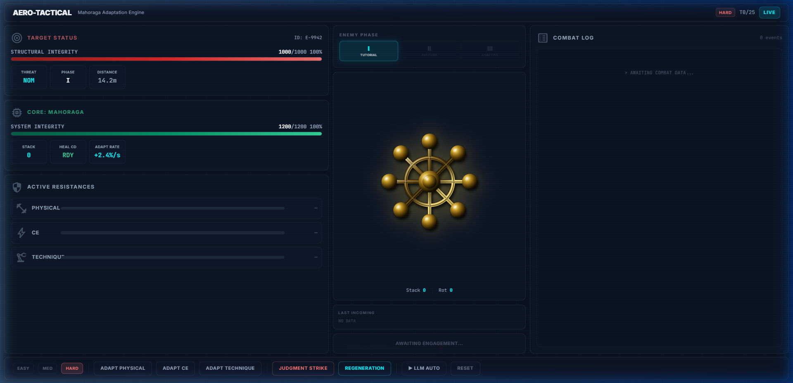

# ⚔️ Project Mahoraga — Adaptation Engine

An RL-based combat AI that learns to fight like Mahoraga from JJK — observing enemy attack patterns, adapting its resistances in real-time, and executing devastating Judgment Strikes when stacks are built.

**Trained on Qwen 2.5 3B (LoRA)** using reward-weighted SFT with a custom curriculum-based enemy across 3 phases.



---

## 🚀 Quick Start

### Frontend Dashboard (Recommended)

```bash
# Terminal 1: Start the API server
python api.py
# → FastAPI on http://localhost:8000

# Terminal 2: Start the React dashboard
cd frontend
npm install    # first time only
npm run dev
# → Dashboard on http://localhost:5173
```

### Gradio UI (Lightweight Alternative)

```bash
python app.py
# → Gradio on http://localhost:7860
```

---

## 🎮 Features

### Aero-Tactical Dashboard
- **Viewport-locked bento-grid** layout — no scrolling, pure tactical overview
- **Animated HP / Resistance bars** with spring physics (Framer Motion)
- **Golden Mahoraga Wheel** — rotates 45° per adaptation, 180° on Judgment Strike
- **Screen shake** on heavy hits, full-screen flash on Judgment Strike
- **Combat log** with timeline-style entries and color-coded attack categories

### Difficulty Levels

| Level | Enemy Behavior | Color |
|-------|---------------|-------|
| **EASY** | Always PHYSICAL attacks (Phase I only) | 🟢 Green |
| **MEDIUM** | Cycling attacks, no adaptive targeting | 🟡 Amber |
| **HARD** | Full 3-phase AI — targets your weakest resistance | 🔴 Red |

### LLM Auto-Play

Click **▶ LLM AUTO** to let the trained Qwen 2.5 3B model fight autonomously:
- Model loads on first click (~30-60s, uses ~2.5GB VRAM)
- Plays one turn every 1.2s with full animations
- Falls back to a smart rule-based agent if GPU unavailable

### Color-Coded Attack Categories

| Category | Color | Subtypes |
|----------|-------|----------|
| **PHYSICAL** | 🟠 Orange | SLASH, IMPACT, PIERCE |
| **CE** (Cursed Energy) | 🟣 Purple | BLAST, WAVE, BEAM |
| **TECHNIQUE** | 🔵 Teal | SPIKE, DELAYED, PATTERN |

---

## 🏗️ Architecture

```
Mahoraga/
├── api.py                  # FastAPI server (REST endpoints + LLM inference)
├── app.py                  # Gradio UI (standalone alternative)
├── env/
│   ├── mahoraga_env.py     # Main RL environment (MahoragaEnv)
│   ├── enemy.py            # 3-phase curriculum enemy (CurriculumEnemy)
│   ├── mechanics.py        # Combat math (damage, resistances, judgment)
│   └── rewards.py          # Reward functions (7 components)
├── utils/
│   ├── constants.py        # Game constants (HP, damage, categories)
│   └── validators.py       # Action validation
├── frontend/               # React dashboard
│   ├── src/App.jsx         # Main UI (727 lines)
│   ├── src/index.css       # Design system (glass panels, animations)
│   └── vite.config.js      # Vite + proxy to FastAPI
├── mahoraga_loral_final/   # Trained LoRA weights (not in git)
│   ├── adapter_config.json
│   ├── adapter_model.safetensors
│   └── tokenizer*.json
└── notebooks/
    └── mahoraga_training.py  # Kaggle training notebook
```

---

## 🧠 How The AI Works

### Environment (MahoragaEnv)

Turn-based combat where Mahoraga has 5 actions:
- **0-2:** Adapt resistance (Physical / CE / Technique) — +40 to target, -20 to others
- **3:** Judgment Strike — base 350 DMG + 50 per adaptation stack (resets stacks)
- **4:** Regeneration — heal 300 HP (3-turn cooldown)

### Curriculum Enemy (3 Phases)

| Phase | Turns | Behavior |
|-------|-------|----------|
| I — Tutorial | 1-5 | Always PHYSICAL |
| II — Pattern | 6-15 | Cycles PHYSICAL → CE → TECHNIQUE (15% random deviation) |
| III — Adaptive | 16+ | Targets the agent's **lowest resistance** |

### Reward Signal (7 components)

| Component | Signal |
|-----------|--------|
| Survival | `-damage_taken / 100` |
| Combat | `+damage_dealt / 80` |
| Adaptation | `+0.8` for correct match |
| Anti-cowardice | `-1.0` for healing at high HP |
| Efficiency | `+1.0` for burst damage ≥200 |
| Terminal | `+10` win / `-8` loss |
| Opportunity | `-0.5` for not attacking at stack ≥2 |

### Training

- **Model:** Qwen 2.5 3B Instruct (4-bit quantized via Unsloth)
- **Method:** LoRA (r=16, α=16) targeting q/k/v/o projections
- **Algorithm:** Reward-weighted SFT with episode-level modifiers + expert trajectory seeding
- **Platform:** Kaggle (T4 GPU)

---

## 🔌 API Reference

| Method | Endpoint | Body | Description |
|--------|----------|------|-------------|
| `POST` | `/api/reset` | `{ "difficulty": "easy"\|"medium"\|"hard" }` | Reset environment |
| `POST` | `/api/step` | `{ "action": 0-4 }` | Execute one manual turn |
| `POST` | `/api/auto-step` | — | LLM picks the action |
| `GET` | `/api/model-status` | — | Check if LLM is loaded |

---

## 📦 Dependencies

### Backend
```
fastapi uvicorn pydantic         # API server
torch transformers peft          # LLM inference
bitsandbytes accelerate          # 4-bit quantization
unsloth                          # Optional: faster inference
gradio                           # Alternative UI
```

### Frontend
```
react framer-motion              # UI + animations
tailwindcss @tailwindcss/vite    # Styling
vite                             # Build tool
```

---

## 🖥️ Hardware Requirements

| Component | Minimum | Recommended |
|-----------|---------|-------------|
| GPU (for LLM) | GTX 1650 (4GB) | RTX 3060 (12GB) |
| RAM | 8 GB | 16 GB |
| Storage | 500 MB (+ ~2GB model) | Same |

> **No GPU?** The dashboard works fully in manual mode. Auto-play falls back to a rule-based agent.

---

## 👥 Team

Built by **Atishay** — [GitHub](https://github.com/Atishay9828)

---

*"The more it is hit, the more it adapts. That is the nature of Mahoraga."*
